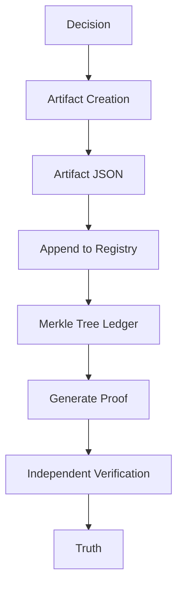

# Decision Integrity Protocol (DIP)

A minimal protocol for **verifiable automated decisions**.

DIP enables automated systems to produce decision artifacts that can be **independently verified without trusting the original platform**.

---

## Protocol Invariant

```
artifact + proof + verifier = truth
```

---

## Protocol Flow

```
decision
   ↓
artifact
   ↓
registry
   ↓
proof
   ↓
verification
```

---

## Protocol Architecture



---

## Quickstart (30 seconds)

Run the full DIP pipeline locally.

Clone the repositories:

```bash
git clone https://github.com/dip-protocol/dip-cli
git clone https://github.com/dip-protocol/dip-registry
git clone https://github.com/dip-protocol/dip-go-verifier
git clone https://github.com/dip-protocol/dip
```

Build the CLI:

```bash
cd dip
go build ./cmd/dip
```

Run a demo decision:

```bash
dip demo decision.json
```

Expected output:

```
Step 1: Signing decision
DIP artifact created

Step 2: Appending artifact
Record appended to registry

Step 3: Verifying artifact
Artifact verified successfully

DIP pipeline complete
artifact + proof + verifier = truth
```

---

## Example

```bash
dip demo decision.json
```

---

## Repositories

| Repository | Purpose |
|-----------|--------|
| dip-spec | Protocol specification |
| dip-cli | Artifact creation |
| dip-registry | Append-only decision ledger |
| dip-go-verifier | Independent verifier |
| dip | Unified CLI |

---

## Documentation

| Section | Location |
|-------|--------|
| Protocol Specification | `spec/v1` |
| Conformance Tests | `conformance/test-vectors` |
| Governance | `governance` |
| Research | `research` |
| Whitepaper | `whitepaper` |

---

## Protocol Pipeline

```
decision.json
      │
      ▼
dip sign
      │
      ▼
artifact.json
      │
      ▼
dip append
      │
      ▼
registry ledger
      │
      ▼
dip proof
      │
      ▼
proof.json
      │
      ▼
dip verify
```

---

## Status

**Protocol Version:** v0.1  
**Stability:** Experimental